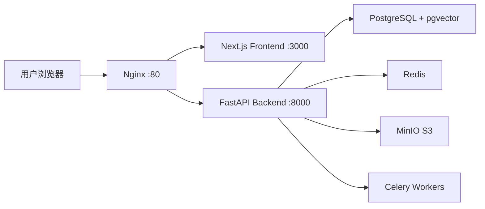

# 品猹开源准备清单

本文档列出品猹项目开源前需要处理的所有事项，按优先级分为 **P0（必须）**、**P1（推荐）**、**P2（可选）**。

---

## P0 - 安全与隐私（必须处理）

### 1. 移除硬编码的私有服务 URLs

**问题：** 代码中包含私有 API 网关地址

**影响文件：**
- `backend/app/config.py:34` — `SUMMARY_API_BASE: str = "https://tokendance.agent-universe.cn/gateway/v1"`

**修复方案：**
```python
# 改为通用默认值或空字符串
SUMMARY_API_BASE: str = ""  # 或 "https://api.openai.com/v1"
```

**说明：** 开源版本应该让用户配置自己的 LLM API 端点，不要硬编码私有网关。

---

### 2. 移除硬编码的代理配置

**问题：** `docker-compose.yml` 中包含个人本地代理地址 `http://host.docker.internal:7897`

**影响文件：**
- `docker-compose.yml` 多处（11 处引用）
- `docker-compose.infra.yml`
- `docs/docker-guide.md`

**修复方案：**
```yaml
# 方案 1: 改为环境变量（推荐）
- HTTP_PROXY=${HTTP_PROXY:-}
- HTTPS_PROXY=${HTTPS_PROXY:-}
- YOUTUBE_PROXY=${YOUTUBE_PROXY:-}

# 方案 2: 完全移除这些行，在 .env.example 中添加说明
# 如果你在中国大陆需要访问 YouTube，请在 .env 中设置：
# HTTP_PROXY=http://your-proxy:port
# HTTPS_PROXY=http://your-proxy:port
```

**还需要更新：**
- `bgutil-provider` 服务的 `HTTP_PROXY` 和 `HTTPS_PROXY` 环境变量
- `backend` 服务的 `YOUTUBE_PROXY` 环境变量
- `.env.example` 添加代理配置说明

---

### 3. 观猹 OAuth 依赖说明

**问题：** 项目强依赖私有 OAuth 提供商"观猹"（watcha.cn）

**影响范围：**
- `backend/app/api/v1/auth.py` — 完整的 OAuth 流程
- `backend/app/core/auth.py` — JWT 认证逻辑
- `backend/app/models/user.py` — 用户模型包含 `watcha_user_id`、`watcha_access_token` 等字段
- 数据库迁移文件

**修复方案（多种选项）：**

#### 选项 A：保留观猹 OAuth + 添加通用 OAuth 支持
- 重构认证层，支持多种 OAuth 提供商（GitHub、Google、自定义）
- 添加 `OAuth2Provider` 配置表
- 用户可以选择禁用 OAuth，使用邮箱密码登录

#### 选项 B：仅文档说明 + 提供示例配置
- 在 README 中明确说明：项目默认使用观猹 OAuth，用户需要：
  - 要么注册观猹账号获取 OAuth 应用
  - 要么修改 `auth.py` 替换为自己的 OAuth 提供商
- 提供 GitHub OAuth 的示例代码（在 `docs/oauth-examples/github.md`）

#### 选项 C：移除 OAuth，改为简单认证
- 移除观猹 OAuth 依赖
- 实现基础的邮箱密码登录
- 可选：添加 API Token 认证

**推荐方案：** 选项 B（短期）+ 选项 A（长期路线图）

---

### 4. 移除个人信息

**问题：** README 中提到个人 GitHub 账号

**影响文件：**
- `README.md:5` — `*主要开发：[@6ackpacks](https://github.com/6ackpacks)*`

**修复方案：**
```markdown
# 改为
*主要开发：[@你的新GitHub组织](https://github.com/your-org)* 或仅保留项目仓库链接

# 或添加贡献者部分
## 贡献者
- [@6ackpacks](https://github.com/6ackpacks) - 项目发起人与主要维护者
```

---

### 5. 检查 Git 历史中的敏感信息

**需要检查：**
```bash
# 检查是否有提交过敏感文件
git log --all --full-history -- .env
git log --all --full-history -- cookies/

# 检查提交信息中是否包含密钥
git log --all --grep="api[_-]key" -i
git log --all --grep="password" -i
git log --all --grep="secret" -i
```

**如果发现敏感信息：**
- 使用 `git-filter-repo` 或 BFG Repo-Cleaner 清理历史
- 重新生成所有泄露的密钥
- 开源版本从干净的历史点开始（推荐）

---

## P1 - 用户友好性（强烈推荐）

### 6. 添加开源协议

**问题：** 项目根目录没有 `LICENSE` 文件

**推荐协议：**
- **MIT** — 最宽松，允许商业使用
- **Apache 2.0** — 类似 MIT，但包含专利授权
- **AGPL-3.0** — 如果希望强制开源衍生服务

**操作：**
```bash
# 选择协议后创建 LICENSE 文件
# 例如 MIT:
curl https://opensource.org/licenses/MIT -o LICENSE
# 然后修改年份和作者信息
```

---

### 7. 完善 README 文档

**当前问题：** README 已经很好，但缺少一些关键信息

**需要补充：**

#### a. 先决条件（Prerequisites）
```markdown
## 先决条件

- Docker 20.10+ & Docker Compose 2.0+
- 或本地开发：Python 3.11+, Node.js 20+, PostgreSQL 16+, Redis 7+
- 至少一个 LLM API 密钥（OpenAI / Anthropic / DeepSeek / 智谱等）
```

#### b. 常见问题（FAQ）
```markdown
## 常见问题

**Q: 不在中国大陆，能否使用？**
A: 可以，移除 docker-compose.yml 中的代理配置即可。

**Q: 必须使用观猹 OAuth 吗？**
A: 当前版本是的。计划中支持 GitHub/Google OAuth。可参考 docs/oauth-examples/ 替换为自己的提供商。

**Q: 支持哪些 LLM？**
A: 通过 LiteLLM 支持 OpenAI、Anthropic、智谱、DeepSeek、通义千问等 100+ 模型。

**Q: 能否只用于本地？不连接外部 LLM？**
A: 需要 LLM API 用于摘要生成。可以部署本地 LLM（如 Ollama）并配置 SUMMARY_API_BASE。
```

#### c. 路线图（Roadmap）
```markdown
## 路线图

- [ ] 支持多种 OAuth 提供商（GitHub、Google）
- [ ] 本地 Whisper ASR 支持
- [ ] 插件系统
- [ ] 多用户协作功能
- [ ] 移动端适配
```

#### d. 贡献指南
```markdown
## 贡献指南

欢迎贡献！请先阅读 [CONTRIBUTING.md](CONTRIBUTING.md)。

简要流程：
1. Fork 项目
2. 创建特性分支 (`git checkout -b feature/AmazingFeature`)
3. 提交改动 (`git commit -m 'Add some AmazingFeature'`)
4. 推送到分支 (`git push origin feature/AmazingFeature`)
5. 开启 Pull Request
```

---

### 8. 创建 CONTRIBUTING.md

**内容包括：**
- 开发环境搭建
- 代码风格指南（Python: Black/Ruff, TypeScript: ESLint）
- 提交信息规范（Conventional Commits）
- PR 模板
- 行为准则（Code of Conduct）

---

### 9. 添加架构图

**建议：** 在 `docs/architecture.md` 或 README 中添加：
- 系统架构图（前端 → Nginx → 后端 → 数据库/Redis/MinIO）
- 数据流图（视频处理管道）
- 技术栈关系图

可以使用 Mermaid 图表：
```markdown

```

---

### 10. 环境变量文档化

**建议：** 在 `docs/configuration.md` 中详细说明每个环境变量：

```markdown
## 核心配置

| 变量 | 必需 | 默认值 | 说明 |
|------|------|--------|------|
| `DATABASE_URL` | ✅ | `postgresql+asyncpg://...` | PostgreSQL 连接串 |
| `OPENAI_API_KEY` | ✅ | 无 | OpenAI API 密钥（或兼容端点） |
| `JWT_SECRET_KEY` | ✅ | 无 | JWT 签名密钥（至少 32 字符） |
| `WATCHA_CLIENT_ID` | ✅ | 无 | 观猹 OAuth 客户端 ID |

## 可选配置

| 变量 | 默认值 | 说明 |
|------|--------|------|
| `WHISPER_API_BASE` | 空 | Whisper ASR 端点（空则回退到 SUMMARY_API_BASE） |
| `HTTP_PROXY` | 空 | HTTP 代理（中国大陆访问 YouTube 需要） |
...
```

---

## P2 - 代码质量与维护性（可选但推荐）

### 11. 添加 CI/CD

**建议工作流（GitHub Actions）：**

#### `.github/workflows/backend-tests.yml`
```yaml
name: Backend Tests
on: [push, pull_request]
jobs:
  test:
    runs-on: ubuntu-latest
    services:
      postgres:
        image: pgvector/pgvector:pg16
        env:
          POSTGRES_PASSWORD: postgres
      redis:
        image: redis:7-alpine
    steps:
      - uses: actions/checkout@v3
      - uses: actions/setup-python@v4
        with:
          python-version: '3.11'
      - run: pip install -r backend/requirements.txt pytest
      - run: pytest backend/tests/
```

#### `.github/workflows/frontend-tests.yml`
```yaml
name: Frontend Tests
on: [push, pull_request]
jobs:
  test:
    runs-on: ubuntu-latest
    steps:
      - uses: actions/checkout@v3
      - uses: actions/setup-node@v3
        with:
          node-version: '20'
      - run: cd frontend && npm ci
      - run: cd frontend && npm run lint
      - run: cd frontend && npm run test
```

---

### 12. 添加健康检查端点文档

**建议：** 在 README 或 API 文档中说明：
```markdown
## 健康检查

- `GET /health` — 后端健康状态
- `GET /api/v1/health` — API 版本信息
- 数据库连接状态
- Redis 连接状态
```

---

### 13. Docker 镜像优化

**当前问题：** 开发模式的 Dockerfile 可能不适合生产

**建议：**
1. 区分 `Dockerfile.dev` 和 `Dockerfile.prod`
2. 使用多阶段构建减小镜像体积
3. 前端使用 `standalone` 输出（已完成）
4. 考虑提供预构建的 Docker 镜像（发布到 Docker Hub 或 GHCR）

---

### 14. 移除或文档化内部工具

**需要检查：**
- `docs/remediation-plan.md` — 这是内部安全整改计划，是否需要开源？
- `docs/调研-*.md` — 内部调研文档，是否包含敏感信息？

**建议：**
- 移动到私有仓库的 `private-docs/` 目录
- 或者在开源版本中删除

---

### 15. 添加 Issue 和 PR 模板

#### `.github/ISSUE_TEMPLATE/bug_report.md`
```markdown
---
name: Bug 报告
about: 创建一个错误报告帮助我们改进
---

**描述 bug**
清晰简洁地描述这个 bug。

**重现步骤**
1. 进入 '...'
2. 点击 '....'
3. 滚动到 '....'
4. 看到错误

**期望行为**
描述你期望发生什么。

**截图**
如果适用，添加截图以帮助解释你的问题。

**环境 (请完成以下信息):**
 - OS: [e.g. Ubuntu 22.04]
 - Docker 版本: [e.g. 20.10.21]
 - 浏览器: [e.g. chrome, safari]
 - 版本: [e.g. 22]

**额外上下文**
在这里添加关于问题的任何其他上下文。
```

---

## P3 - 长期改进建议

### 16. 国际化（i18n）

**当前状态：** 界面和 prompt 都是中文

**建议：**
- 前端使用 `next-intl` 或 `react-i18next`
- 摘要 prompt 支持多语言（根据 `Accept-Language` 头）
- 至少支持中文、英文

---

### 17. 解耦 SurfSense

**当前问题：** `.gitignore` 中排除了 `SurfSense/` 目录

**建议：**
- 明确说明 SurfSense 和品猹的关系
- 如果品猹是 fork，考虑是否应该：
  - 保留在同一个仓库（monorepo）
  - 拆分为独立项目
  - 完全移除 SurfSense 代码

---

## 实施步骤建议

### 阶段 1：安全清理（1-2 天）
1. 检查并清理 Git 历史中的敏感信息
2. 修复 P0-1 到 P0-5 所有安全问题
3. 生成新的示例配置文件

### 阶段 2：文档完善（2-3 天）
1. 添加 LICENSE
2. 完善 README
3. 创建 CONTRIBUTING.md
4. 添加架构图和配置文档

### 阶段 3：代码重构（可选，1-2 周）
1. OAuth 解耦或多提供商支持
2. 移除硬编码的私有服务
3. Docker 镜像优化

### 阶段 4：发布准备
1. 创建 GitHub 组织或使用个人账号
2. 设置 GitHub Pages（文档站点）
3. 添加 CI/CD
4. 发布 v1.0.0 release
5. 提交到 awesome-selfhosted 等列表

---

## 检查清单（Checklist）

开源前请确认：

- [ ] 所有 P0 问题已修复
- [ ] `.env.example` 不包含真实密钥
- [ ] Git 历史中无敏感信息
- [ ] 添加了 LICENSE 文件
- [ ] README 包含完整的安装和配置说明
- [ ] 移除了所有个人信息（邮箱、用户名、内部 URL）
- [ ] 代理配置改为可选
- [ ] OAuth 依赖有清晰说明
- [ ] Docker Compose 能在干净环境启动
- [ ] 至少有一个可工作的示例配置
- [ ] 文档中包含常见问题解答
- [ ] 添加了贡献指南
- [ ] 有明确的联系方式（GitHub Issues）

---

## 维护两个代码库的策略

### 方案 A：Git 分支策略
```
main (私有仓库)
  ├── public (定期同步到开源仓库)
  └── private (包含私有配置)
```

### 方案 B：独立仓库 + 定期合并
```
私有仓库: pingcha-internal
  - 包含所有代码 + 私有配置

开源仓库: pingcha
  - 手动同步功能代码
  - 使用通用配置
```

### 方案 C：Monorepo + 子模块
```
pingcha-internal/
  ├── core/ (git submodule → 开源仓库)
  └── internal/ (私有配置、脚本)
```

**推荐：** 方案 A（简单） 或 方案 B（明确隔离）

---

## 相关资源

- [开源指南](https://opensource.guide/zh-hans/)
- [如何选择开源协议](https://choosealicense.com/)
- [Git 历史清理工具 BFG](https://rtyley.github.io/bfg-repo-cleaner/)
- [Awesome First PR Opportunities](https://github.com/MunGell/awesome-for-beginners)
