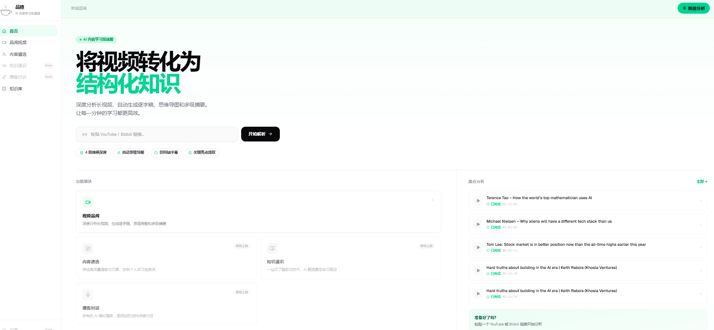

<div align="center">


# 品猹 (Pingcha)

**AI 内容学习书房 — 将视频专化为结构化知识**

粘贴一个视频链接，AI 自动提取字幕、生成四级摘要、绘制思维导图，
并将零散内容整理为可检索、可追问的个人知识库。

[](LICENSE)
[](docker-compose.yml)
[](https://github.com/6ackpacks/pincha)

</div>

---

<p align="center">
  
</p>

## 核心功能

<table>
<tr>
<td width="50%">

**视频品读**
- 粘贴 YouTube / Bilibili 链接即可开始
- 自动提取字幕（平台字幕 > TikHub > Whisper ASR）
- 四级摘要：速览 5% → 精华 30% → 详细 60% → 完整 90%
- AI 思维导图，点击节点跳转对应片段

</td>
<td width="50%">

**知识图谱**
- 从视频/文章自动编译 Wiki 知识页面
- 实体抽取 + 关系图谱可视化（Sigma.js）
- 社区发现，自动聚类相关知识

</td>
</tr>
<tr>
<td>

**知识库 RAG**
- 内容自动向量化入库（pgvector）
- 基于 RAG 的跨内容语义检索与追问
- 支持视频、文章、播客多类型内容

</td>
<td>

**内容精选**
- 订阅内容频道，每日 AI 筛选值得细读的线索
- 深度分析 + 邮件摘要推送
- 支持播客解析（说话人分离）

</td>
</tr>
</table>

---

## 快速开始

> **前置条件：** Docker + Docker Compose，建议 CPU >= 2 核 / 内存 >= 4 GB

### 第 1 步：克隆 & 配置

```bash
git clone https://github.com/6ackpacks/pincha.git
cd pincha
cp .env.example .env
```

### 第 2 步：获取 API Key

品猹的 AI 功能需要两个 API Key，获取后填入 `.env` 即可启用全部能力：

<table>
<tr>
<th>服务</th>
<th>用途</th>
<th>必需</th>
<th>获取方式</th>
</tr>
<tr>
<td><strong>TokenDance</strong></td>
<td>AI 摘要 / 思维导图 / Wiki 编译 / Embedding / ASR</td>
<td align="center">✅</td>
<td>

[](https://tokendance.space)

</td>
</tr>
<tr>
<td><strong>TikHub</strong></td>
<td>视频字幕获取（国内免代理，约 0.001 元/次）</td>
<td align="center">推荐</td>
<td>

[](https://tikhub.io)

</td>
</tr>
</table>

将获取到的 Key 填入 `.env`：

```bash
# AI 功能（必填）— 一个 Key 驱动全部 AI 能力
OPENAI_API_KEY=sk-你的-tokendance-key
SUMMARY_API_BASE=https://tokendance.space/gateway/v1

# 字幕获取（推荐）— 国内服务器免翻墙获取 YouTube 字幕
TIKHUB_API_KEY=你的-tikhub-key
```

> 只需这两个 Key，品猹的 **摘要生成、思维导图、知识图谱、向量检索、语音识别** 全部功能即可使用。

### 第 3 步：生成 JWT 密钥

```bash
python -c "import secrets; print(secrets.token_urlsafe(32))"
# 将输出填入 .env 的 JWT_SECRET_KEY
```

### 第 4 步：启动

```bash
docker-compose up -d
```

访问 **http://localhost** 即可使用。粘贴一个 YouTube 视频链接试试！

---

## 配置说明

<details>
<summary><strong>完整环境变量参考</strong></summary>

| 变量 | 必需 | 说明 | 示例 |
|------|:----:|------|------|
| `OPENAI_API_KEY` | ✅ | TokenDance API Key | `sk-xxxxxxxx` |
| `SUMMARY_API_BASE` | ✅ | AI 网关地址 | `https://tokendance.space/gateway/v1` |
| `TIKHUB_API_KEY` | 推荐 | TikHub 字幕服务 Key | `your-key` |
| `JWT_SECRET_KEY` | ✅ | JWT 签名密钥（≥32 字符） | `python -c "import secrets; print(secrets.token_urlsafe(32))"` |
| `ADMIN_TOKEN` | 可选 | 管理后台 Token | 任意字符串 |
| `SUMMARY_MODEL` | 可选 | 摘要模型（默认 deepseek-v4-flash） | `openai/deepseek-v4-flash` |
| `EMBEDDING_MODEL` | 可选 | 向量化模型 | `openai/text-embedding-v3` |
| `WHISPER_API_BASE` | 可选 | ASR 端点（留空复用 SUMMARY_API_BASE） | |
| `YOUTUBE_PROXY` | 可选 | yt-dlp 代理（不用 TikHub 时需要） | `http://127.0.0.1:7897` |
| `XFYUN_APP_ID` | 可选 | 讯飞 ASR（播客说话人分离） | |
| `VOLC_ASR_APP_ID` | 可选 | 火山引擎 ASR | |
| `DATABASE_URL` | 默认 | PostgreSQL 连接串 | Docker 默认即可 |
| `REDIS_URL` | 默认 | Redis 连接串 | Docker 默认即可 |

</details>

<details>
<summary><strong>字幕获取降级策略</strong></summary>

品猹使用多级降级策略获取字幕，按优先级从高到低：

1. **TikHub**（推荐）— 服务端代理 YouTube，国内可直连，约 0.001 元/次
2. **youtube-transcript-api** — 免费本地库，需代理访问 YouTube
3. **yt-dlp 平台字幕** — 免费，需代理
4. **Whisper ASR 语音识别** — 从音频转录，消耗较多 AI token

只要配置了 TikHub，绝大部分视频都能直接获取字幕，无需额外代理配置。

</details>

<details>
<summary><strong>认证系统</strong></summary>

> 当前版本默认使用观猹（Watcha）OAuth2 登录。开源部署时，请按下面的方式接入自己的认证提供商，或在本地开发时使用 `/dev-login` 跳过登录。

**本地开发免登录：** 设置 `APP_ENV=development`，访问 `http://localhost:8000/api/v1/auth/dev-login` 自动创建开发用户并登录。

**替换 OAuth 提供商（GitHub / Google 等）：** 修改 `backend/app/api/v1/auth.py` 中的三个端点常量：

```python
_WATCHA_AUTH_URL     = "https://github.com/login/oauth/authorize"
_WATCHA_TOKEN_URL    = "https://github.com/login/oauth/access_token"
_WATCHA_USERINFO_URL = "https://api.github.com/user"
```

详见 `auth.py` 中 `callback()` 函数的字段映射注释。

</details>

---

## 本地开发

<details>
<summary><strong>不使用 Docker 的本地开发环境</strong></summary>

```bash
# 基础设施
docker-compose -f docker-compose.infra.yml up -d

# 后端
cd backend
pip install -r requirements.txt
alembic upgrade head
uvicorn app.main:app --reload --port 8000

# 前端
cd frontend
npm install
npm run dev   # http://localhost:3000

# Celery worker（在 backend/ 目录下）
celery -A app.tasks.celery_app worker -Q pingcha -c 4
celery -A app.tasks.celery_app worker -Q pingcha.pipeline -c 10
celery -A app.tasks.celery_app beat
```

</details>

---

## 技术架构

<details>
<summary><strong>服务拓扑</strong></summary>

```
                    ┌─────────────────────────────────────────────┐
                    │              Nginx (端口 80)                  │
                    │   /api/*  → backend:8000                     │
                    │   其他    → frontend:8080                     │
                    └────────────┬──────────────┬─────────────────┘
                                 │              │
                    ┌────────────▼──┐    ┌──────▼──────────┐
                    │  Backend      │    │  Frontend       │
                    │  FastAPI      │    │  Next.js 15     │
                    └───────┬───────┘    └─────────────────┘
                            │
              ┌─────────────┼─────────────┐
              │             │             │
     ┌────────▼──┐  ┌──────▼──┐  ┌──────▼──┐
     │ PostgreSQL │  │  Redis   │  │  MinIO   │
     │ + pgvector │  │         │  │         │
     └────────────┘  └──────────┘  └──────────┘
```

</details>

<details>
<summary><strong>技术栈</strong></summary>

| 层 | 技术 |
|---|------|
| 后端 | FastAPI + SQLAlchemy async + Celery + Redis |
| 数据库 | PostgreSQL 16 + pgvector |
| AI | LiteLLM（多模型）+ Whisper（ASR）+ yt-dlp（字幕）|
| 前端 | Next.js 15 + React 19 + Jotai + TanStack Query |
| UI | Shadcn/ui + Tailwind CSS 4 + xgplayer |
| 可视化 | Sigma.js（图谱）+ Markmap（思维导图） |
| 部署 | Docker Compose（10 服务）+ Nginx |

</details>

<details>
<summary><strong>Celery 队列</strong></summary>

| 队列 | 并发 | 职责 |
|------|------|------|
| `pingcha` | 4 | 通用任务（摘要、ASR） |
| `pingcha.pipeline` | 10 | 视频/文章处理管线 |
| `pingcha.curate` | 2 | 内容精选 |
| `pingcha.cron` | 1 | 定时任务 |

</details>

---

## 贡献

欢迎 PR 和 Issue！详见 [CONTRIBUTING.md](CONTRIBUTING.md)。

## License

[Apache License 2.0](LICENSE)
