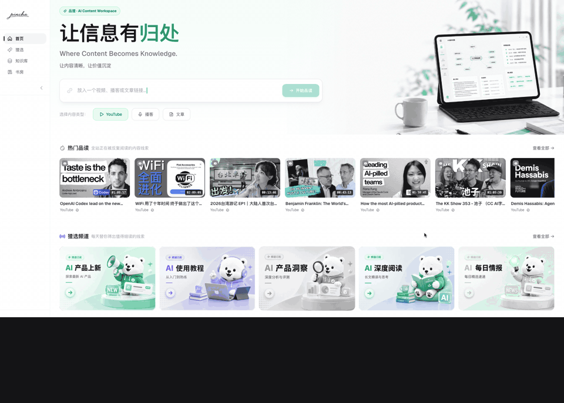
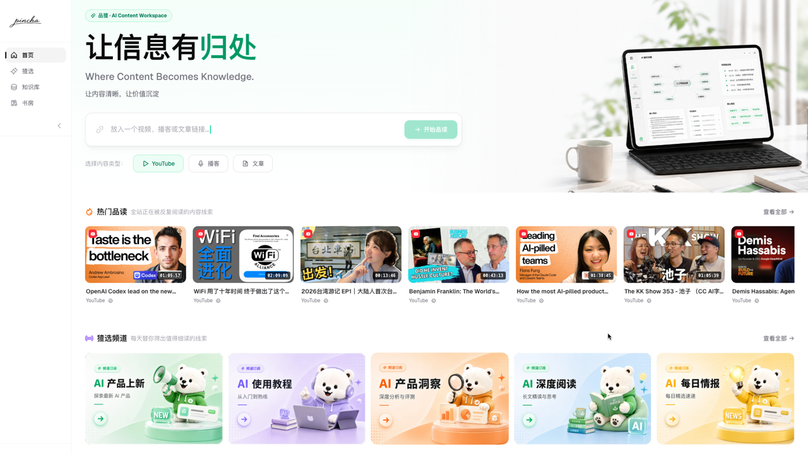

<p align="center">
  
</p>

<h1 align="center">Pincha</h1>

<p align="center">
  Turn videos, podcasts, articles, and daily AI signals into transcripts, summaries, mind maps, and a searchable knowledge base.
</p>

<p align="center">
  <a href="LICENSE"></a>
  <a href="docker-compose.yml"></a>
  
  
</p>

> Recommended first: use **Talkdance** for the hosted product experience. This repository is the open-source, self-hosted Pincha codebase for developers and local deployment.

<p align="center">
  
</p>

## What Pincha Does

Pincha is an AI content workspace for people who learn from long-form media. Instead of keeping scattered links, you can save a video, podcast, article, or curated signal, then let Pincha turn it into structured knowledge you can read, search, connect, and ask about later.

The open-source edition is designed for single-user local deployment. It has no login, registration, external identity callback, or multi-user account system. When the backend starts, it creates one stable Local Owner and stores all content under that local owner.

## Features

### 1. Read Videos Like Documents

Pincha extracts or receives transcripts, builds chapters, generates multi-level summaries, keeps source timing, and lets you move between the original video and the written analysis.

<p align="center">
  
</p>

What you get:

- Transcript and translated segments
- Chapter navigation with source timestamps
- Express, highlight, detailed, and full summaries
- Mind maps for long-form structure
- Follow-up Q&A over the current content
- Share cards and markdown export

### 2. Collect AI Signals Every Day

Pincha includes a curated reading flow for AI product launches, tutorials, product insights, deep reads, and daily briefs. You can browse channels, subscribe to topics, and send important signals into deeper analysis.

<p align="center">
  
</p>

Useful for:

- Tracking AI product changes
- Following practical tutorials
- Saving market and product observations
- Turning daily reading into reusable notes

### 3. Build A Personal Knowledge Graph

Processed videos, articles, and curated signals can be saved into the knowledge base. Pincha creates pages, relations, tags, and graph views so your saved material becomes connected instead of buried.

<p align="center">
  
</p>

Knowledge features:

- Searchable wiki-style entries
- Entity and concept relationships
- Local and global graph views
- Source links back to original material
- Knowledge-base Q&A with citations

### 4. One Workspace For Long-Form Learning

The home workspace is built around a simple action: paste a link, choose the content type, and let the pipeline produce something readable and reusable.

<p align="center">
  
</p>

Supported flows:

- YouTube and audio/podcast intake
- Article and text intake
- Async background processing
- Global processing queue
- Library and knowledge-base handoff

## Architecture

```text
frontend/        Next.js App Router, React, Tailwind CSS
backend/         FastAPI API and processing services
workers          Celery workers for media, summaries, and indexing
postgres         relational data plus pgvector
redis            cache, queues, and realtime coordination
nginx            reverse proxy for local/container deployment
```

The frontend talks to the backend through typed API clients. Long-running jobs report progress through polling or SSE, and completed artifacts are cached and indexed for later use.

## Quick Start

Use Talkdance if you want the hosted product experience. Use the steps below when you want to run the open-source Pincha stack yourself.

### Requirements

- Docker and Docker Compose
- An OpenAI-compatible LLM API key
- Optional: an OpenAI-compatible speech-to-text endpoint for audio transcription

### Configure

```bash
cp .env.example .env
```

Edit at least these values:

```env
POSTGRES_PASSWORD=change_me_to_a_real_password
OPENAI_API_KEY=replace_with_your_llm_api_key
```

Optional speech-to-text:

```env
WHISPER_API_BASE=https://api.example.com/v1
WHISPER_API_KEY=replace_with_your_asr_api_key
WHISPER_MODEL=whisper-1
```

If a video already has usable captions, Pincha can process it without ASR.

### Run

```bash
docker compose up --build
```

Open:

- App: http://localhost:3000
- API health: http://localhost:8000/health

## Development

Run infrastructure only:

```bash
docker compose -f docker-compose.infra.yml up -d
```

Backend:

```bash
cd backend
pip install -r requirements.txt
pip install -r requirements-test.txt
pytest
```

Frontend:

```bash
cd frontend
npm ci
npm run lint
npm run test
npm run build
```

E2E:

```bash
cd frontend
npm run test:e2e
```

Infrastructure tests under `tests/infrastructure/` are optional and are intended for Docker/nginx validation. Scripts that hit real media URLs are manual checks, not default CI tests.

## Security Notes

Pincha Community Edition is a single-user local deployment. Do not expose an unauthenticated instance directly to the public internet.

Do not commit `.env`, tokens, cookies, private logs, production hostnames, or credentials. If a secret is committed accidentally, rotate it immediately. Removing it in a later commit does not remove it from Git history.

## Documentation

- [Deployment](docs/deployment.md)
- [Environment example](.env.example)
- [Frontend routes](docs/frontend-routes.md)
- [Design system](docs/design-system.md)
- [Contributing](CONTRIBUTING.md)

## License

Apache 2.0. See [LICENSE](LICENSE).
