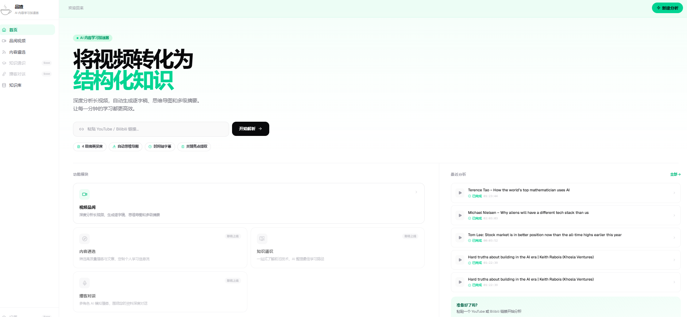

<p align="center">
  
</p>

<h1 align="center">Pincha</h1>

<p align="center">
  Turn long videos and audio into transcripts, summaries, mind maps, and a searchable personal knowledge base.
</p>

<p align="center">
  <a href="LICENSE"></a>
  <a href="docker-compose.yml"></a>
  <a href="CONTRIBUTING.md"></a>
</p>

<p align="center">
  
</p>

## Why Pincha

Pincha is a self-hosted AI content workspace for people who learn from long-form media. Paste a video or audio link, let the backend extract or transcribe the content, then work with structured summaries, citations, mind maps, and saved knowledge entries.

## Features

| Capability | What it does |
| --- | --- |
| Video and audio intake | Submit media URLs and process them asynchronously. |
| Transcript pipeline | Use platform captions, optional transcript providers, or OpenAI-compatible speech-to-text. |
| Structured summaries | Generate concise, detailed, and navigable summaries. |
| Mind maps | Convert long content into visual structure. |
| Knowledge base | Save processed content for search and later review. |
| Self-hosted stack | Runs with Next.js, FastAPI, PostgreSQL + pgvector, Redis, and Docker Compose. |

## Quick Start

Requirements:

- Docker and Docker Compose
- An OpenAI-compatible LLM API key
- Optional: an OpenAI-compatible speech-to-text endpoint for audio transcription

```bash
cp .env.example .env
```

Edit the required values:

```env
JWT_SECRET_KEY=replace_with_a_long_random_secret_at_least_32_chars
POSTGRES_PASSWORD=change_me_to_a_real_password
MINIO_ACCESS_KEY=replace_me
MINIO_SECRET_KEY=replace_me
OPENAI_API_KEY=replace_with_your_llm_api_key
```

Start the stack:

```bash
docker compose up --build
```

Open:

- App: http://localhost:3000
- API health: http://localhost:8000/health

## Speech-to-Text

Pincha does not require a specific speech provider. For audio transcription, configure any OpenAI-compatible endpoint:

```env
WHISPER_API_BASE=https://api.example.com/v1
WHISPER_API_KEY=replace_with_your_asr_api_key
WHISPER_MODEL=whisper-1
```

If a video already has usable captions, Pincha can process it without ASR.

## Development

Run infrastructure only:

```bash
docker compose -f docker-compose.infra.yml up -d
```

Backend:

```bash
cd backend
pip install -r requirements.txt
pytest
```

Frontend:

```bash
cd frontend
npm ci
npm run lint
npm run build
```

## Architecture

```text
frontend/        Next.js app
backend/         FastAPI API and processing services
workers          background media processing and indexing
postgres         relational data + pgvector
redis            cache, queues, and realtime coordination
object storage   optional S3-compatible asset storage
```

Hosted operations, private workflows, and internal product planning documents are intentionally not included in this public repository.

## Documentation

- [Deployment](docs/deployment.md)
- [Environment example](.env.example)
- [Frontend routes](docs/frontend-routes.md)
- [Design system](docs/design-system.md)
- [Contributing](CONTRIBUTING.md)

## Security

Do not commit `.env`, tokens, private logs, account identifiers, production hostnames, or credentials.

If a secret is committed accidentally, rotate it immediately. Removing it in a later commit does not remove it from Git history.

## License

Apache 2.0. See [LICENSE](LICENSE).
