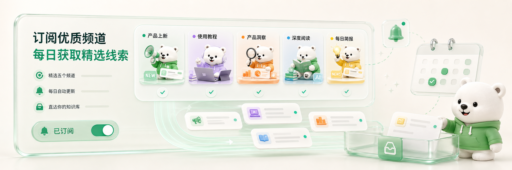
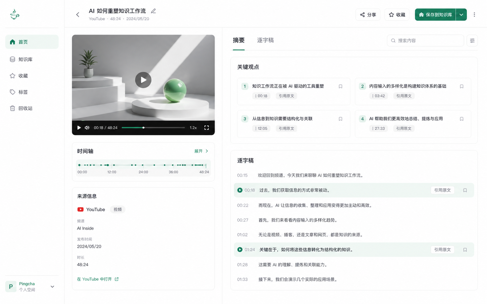
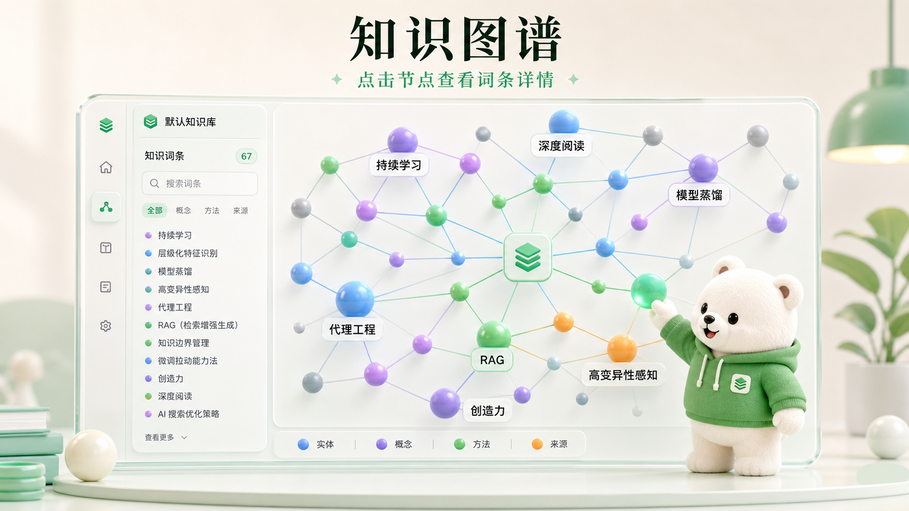

<p align="center">
  
</p>

<h1 align="center">品猹 Pincha</h1>

<p align="center">
  <strong>让信息有归处。</strong>
  <br />
  整理视频、播客、文章与每日线索，汇入可检索、可追问的个人知识库。
  <br />
  <em>Watch Less. Know More.</em>
</p>

<p align="center">
  <a href="LICENSE"></a>
  <a href="docker-compose.yml"></a>
  <a href="frontend/package.json"></a>
  <a href="backend/requirements.txt"></a>
</p>

---

## 品猹是什么

品猹是一个 AI 驱动的个人知识书房。它把分散在视频、播客、文章、RSS 和每日内容线索里的信息，整理成可以长期保存、语义检索、继续追问的知识库。

你可以把它理解为三步：

1. **内容进入**：提交视频、播客、文章，或订阅每日线索。
2. **生成解析**：自动提取字幕/正文，生成概要、层级总结、思维导图与可阅读内容。
3. **知识沉淀**：进入个人知识库，形成图谱、关联检索和后续追问上下文。

适合这些场景：

- 你收藏了很多长视频、播客和文章，但没有时间逐条看完。
- 你希望把内容整理成自己的长期知识库，而不是散落在收藏夹和聊天窗口里。
- 你需要从多个来源找回相关观点、人物、概念和证据。
- 你想订阅某些主题，让系统每天先筛出值得细读的线索。

## 效果展示

### Step 1: 每天筛出值得细读的内容线索

猹选覆盖产品动态、使用教程、产品洞察、深度阅读和每日简报。订阅后，系统会自动更新当天值得看的内容。

<p align="center">
  
</p>

功能特性：

- 订阅你关心的内容频道
- 自动聚合每日线索
- 支持深度分析与通知提醒
- 可把值得保留的内容继续整理进知识库

### Step 2: 把长内容生成可阅读的结构

品猹会把一条长视频或文章拆成可以阅读、检索和追问的结构化知识：先理解全局，再逐层展开，最后回到原文和时间点。

<p align="center">
  
</p>

生成内容：

- 层级总结：速览、精华、详细、完整
- 字幕/正文对齐，保留来源上下文
- 思维导图，帮助快速理解结构
- AI 对话追问，继续围绕当前内容展开

### Step 3: 沉淀成可复用的个人知识库

视频、播客、文章与每日线索会沉淀成节点和连接。你可以从一条内容跳到相关概念、人物、论点和来源。

<p align="center">
  
</p>

知识库能力：

- 自动整理关键词、实体和关系
- 连接相似主题，形成知识图谱
- 用问题找回相关内容和证据
- 从答案回到原文、视频片段或文章来源

## 功能特性

| 模块 | 能力 |
| --- | --- |
| 内容整理 | 支持视频、文章、播客等内容进入处理管线 |
| 字幕与正文提取 | 支持平台字幕、TikHub、yt-dlp、Whisper ASR 等多级降级 |
| AI 总结 | 生成层级摘要、章节、要点和可追问上下文 |
| 思维导图 | 将长内容整理为结构化图谱，支持回到对应片段 |
| 知识库 | 基于 PostgreSQL + pgvector 做语义检索和长期沉淀 |
| 知识图谱 | 抽取实体与关系，可视化内容之间的连接 |
| 猹选订阅 | 订阅频道，每日筛选值得细读的线索 |
| 通知与邮件 | 内容整理完成后可发送通知或邮件摘要 |

## 技术架构

### 后端技术栈

| 技术 | 说明 |
| --- | --- |
| 语言 | Python 3.11+ |
| Web 框架 | FastAPI |
| ORM / 迁移 | SQLAlchemy async + Alembic |
| 异步任务 | Celery + Redis |
| 数据库 | PostgreSQL 16 + pgvector |
| 对象存储 | MinIO |
| AI 接口 | OpenAI-compatible API、Embedding、Whisper ASR |
| 内容解析 | yt-dlp、youtube-transcript-api、BeautifulSoup、trafilatura |

### 前端技术栈

| 技术 | 说明 |
| --- | --- |
| 框架 | Next.js 15 + React 19 |
| 语言 | TypeScript |
| 状态与请求 | Jotai + TanStack Query |
| 样式 | Tailwind CSS 4 |
| 视频播放 | xgplayer |
| 可视化 | Sigma.js、Markmap、3D Force Graph |
| 测试 | Vitest、Playwright |

### 服务拓扑

```text
Nginx
  ├─ Frontend: Next.js
  └─ Backend: FastAPI
       ├─ PostgreSQL + pgvector
       ├─ Redis
       ├─ MinIO
       ├─ RSSHub
       └─ Celery workers
```

## 如何自己部署

### 方式一：Docker Compose 部署（推荐）

前置要求：

- Docker
- Docker Compose
- 建议 2 核 CPU / 4 GB 内存以上

1. 克隆项目

```bash
git clone https://github.com/6ackpacks/pincha.git
cd pincha
```

2. 创建配置文件

```bash
cp .env.example .env
```

3. 生成 JWT 密钥并写入 `.env`

这是必须配置项。品猹使用 JWT 保护登录会话和接口鉴权，后端启动时会校验 `JWT_SECRET_KEY`，长度少于 32 字符会直接报错。生产环境不要使用示例值或固定字符串。

```bash
python3 -c "import secrets; print(secrets.token_urlsafe(32))"
```

把输出填入：

```bash
JWT_SECRET_KEY=替换为上一步生成的随机字符串
```

4. 配置 AI 服务：推荐使用观猹 Token Dance

这里推荐使用观猹平台的 **Token Dance（词元跳动）**，可以一键接入多模型网关，并直接作为品猹的 OpenAI-compatible AI 服务使用。

获取地址：

- Token Dance：https://watcha.cn/products/tokendance

进入页面后：

1. 登录观猹账号。
2. 进入 Token Dance，创建或领取 API Key。
3. 打开本地 `.env`。
4. 填入下面两项：

```bash
OPENAI_API_KEY=your-api-key
SUMMARY_API_BASE=https://tokendance.space/gateway/v1
```

这组配置会驱动品猹里的摘要生成、层级总结、思维导图、知识库编译、知识追问、Embedding 和 ASR 相关能力。

5. 配置字幕获取 API：推荐使用 TranscriptAPI

视频整理要先拿到字幕。品猹内置多级降级，但开源自部署时，推荐先配置一个稳定的字幕 API，减少 YouTube 网络环境带来的失败。

推荐使用：

- TranscriptAPI：https://transcriptapi.com/

进入页面后点击 **Get API Key**，领取 Key 后写入 `.env`：

```bash
TRANSCRIPTAPI_API_KEY=your-transcriptapi-key
```

可选备用：

```bash
# 如果你更常使用 TikHub，也可以配置它作为字幕服务
TIKHUB_API_KEY=your-tikhub-key
```

字幕获取顺序大致为：TikHub → TranscriptAPI → youtube-transcript-api → yt-dlp 平台字幕 → Whisper ASR。没有配置字幕 API 时，仍可尝试本地库和 ASR 兜底，但成功率会更依赖网络环境。

6. 一键启动服务

```bash
docker-compose up -d
```

访问：

- Web 应用：http://localhost
- 前端开发入口：http://localhost:3000
- 后端 API：http://localhost:8000
- MinIO 控制台：http://localhost:9001

最短配置路径：

```bash
cp .env.example .env
python3 -c "import secrets; print(secrets.token_urlsafe(32))"
# 填写 JWT_SECRET_KEY
# 填写 OPENAI_API_KEY / SUMMARY_API_BASE
# 填写 TRANSCRIPTAPI_API_KEY
docker-compose up -d
```

Docker 部署说明：

- 容器不会内置任何 API Key，所有密钥都从本地 `.env` 读取。
- `.env`、cookies、缓存、构建产物都已在 `.gitignore` 中排除，不应提交到开源仓库。
- 如果不配置 TranscriptAPI / TikHub 等字幕服务，YouTube 字幕/音频下载通常需要可用代理或 cookies。

### 方式二：本地开发部署

前置要求：

- Python 3.11+
- Node.js 20.19+、22.12+ 或 24+
- PostgreSQL + pgvector
- Redis
- MinIO

1. 启动基础设施

```bash
docker-compose -f docker-compose.infra.yml up -d
```

2. 启动后端

```bash
cd backend
pip install -r requirements.txt
alembic upgrade head
uvicorn app.main:app --reload --port 8000
```

3. 启动 Celery

```bash
cd backend
celery -A app.tasks.celery_app worker -Q pingcha -c 4
celery -A app.tasks.celery_app worker -Q pingcha.pipeline -c 10
celery -A app.tasks.celery_app worker -Q pingcha.curate -c 2
celery -A app.tasks.celery_app beat
```

4. 启动前端

```bash
cd frontend
npm install
npm run dev
```

访问 http://localhost:3000。

## 配置说明

### 核心环境变量

配置文件：`.env`

| 变量 | 必需 | 说明 |
| --- | :---: | --- |
| `JWT_SECRET_KEY` | 是 | JWT 签名密钥，至少 32 字符随机字符串 |
| `OPENAI_API_KEY` | 是 | AI 服务 API Key |
| `SUMMARY_API_BASE` | 是 | OpenAI-compatible API 地址 |
| `SUMMARY_MODEL` | 推荐 | 摘要与通用生成模型 |
| `EMBEDDING_MODEL` | 推荐 | 向量化模型 |
| `TRANSCRIPTAPI_API_KEY` | 推荐 | YouTube 字幕获取服务，推荐优先配置 |
| `TIKHUB_API_KEY` | 可选 | YouTube 字幕获取备用服务 |
| `DATABASE_URL` | Docker 默认 | PostgreSQL 连接串 |
| `REDIS_URL` | Docker 默认 | Redis 连接串 |
| `MINIO_ENDPOINT` | Docker 默认 | 对象存储地址 |
| `WATCHA_CLIENT_ID` | 可选 | OAuth 登录客户端 ID |
| `WATCHA_CLIENT_SECRET` | 可选 | OAuth 登录客户端密钥 |
| `RESEND_API_KEY` | 可选 | 邮件通知服务 |
| `SENTRY_DSN` | 可选 | 后端错误追踪 |
| `NEXT_PUBLIC_SENTRY_DSN` | 可选 | 前端错误追踪 |

### 字幕获取策略

品猹会按优先级尝试获取字幕：

1. TikHub：服务端代理 YouTube，可作为备用字幕服务。
2. TranscriptAPI：推荐配置，适合稳定获取 YouTube 字幕。
3. youtube-transcript-api：免费本地库，通常需要能访问 YouTube。
4. yt-dlp 平台字幕：免费，通常需要代理或 cookies。
5. Whisper ASR：从音频转录，消耗更多 AI 额度。

### 认证说明

当前版本默认使用 Watcha OAuth2 登录。开源自部署时可以：

- 在开发环境设置 `APP_ENV=development`，使用 `/api/v1/auth/dev-login` 进行本地免登录调试。
- 修改 `backend/app/api/v1/auth.py`，替换为 GitHub、Google 或你自己的 OAuth 提供商。

## 常用命令

```bash
# 查看服务状态
docker-compose ps

# 查看后端日志
docker-compose logs -f backend

# 查看 Celery 日志
docker-compose logs -f celery_pipeline

# 数据库迁移
docker-compose exec backend alembic upgrade head

# 停止服务
docker-compose down
```

## 测试

后端：

```bash
cd backend
pip install -r requirements.txt -r requirements-test.txt
JWT_SECRET_KEY=test-secret-key-with-at-least-32-characters pytest
```

前端：

```bash
cd frontend
npm run lint
npm run test
npm run build
```

端到端测试：

```bash
cd frontend
npm run test:e2e
```

## 注意事项

- 不要提交 `.env`、cookies、私钥、真实 API Key 或内部文档。
- 生产环境务必替换 `JWT_SECRET_KEY`、数据库密码、MinIO 密钥和所有默认凭据。
- 视频、播客和图片处理会消耗 AI/API 配额，请留意供应商限流和费用。
- YouTube 相关能力受网络环境影响较大，推荐配置 TikHub 或可用代理。
- `npm audit` 可能提示上游依赖漏洞，升级前请结合视频播放、图谱和 Sentry 兼容性一起验证。

## 参与贡献

欢迎提交 Issue 和 Pull Request。

开始前建议先阅读：

- [CONTRIBUTING.md](CONTRIBUTING.md)
- [LICENSE](LICENSE)

适合贡献的方向：

- 新内容源接入
- 更稳定的字幕/正文提取
- 知识图谱和检索体验优化
- 自部署文档和部署模板
- 测试覆盖与安全加固

## License

[Apache License 2.0](LICENSE)
