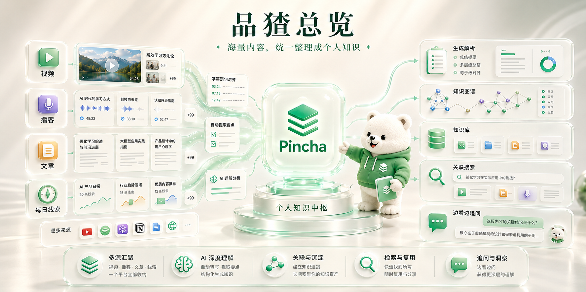
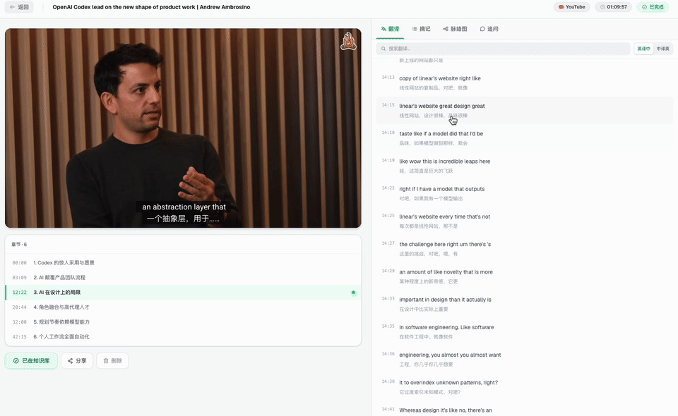
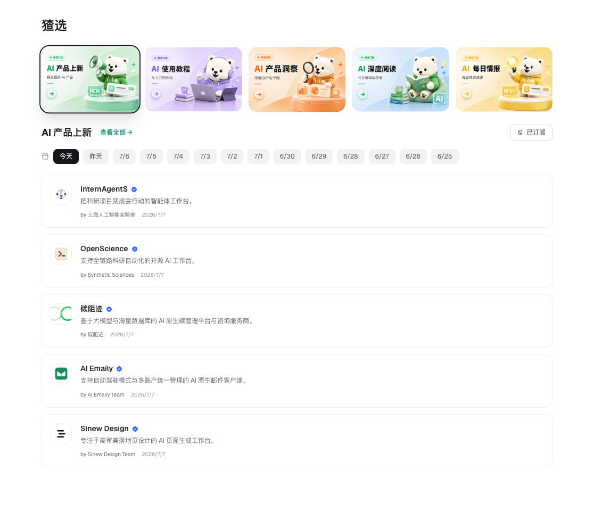
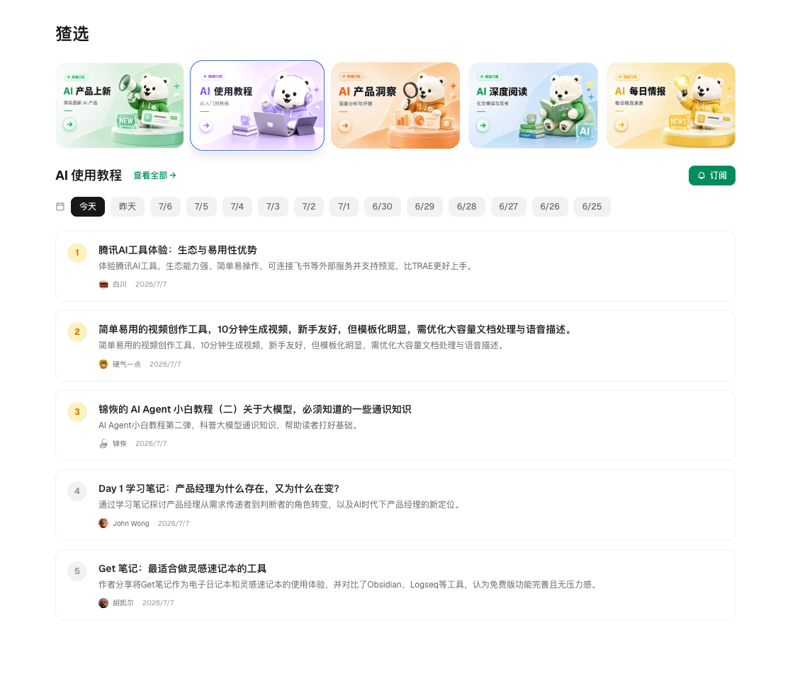
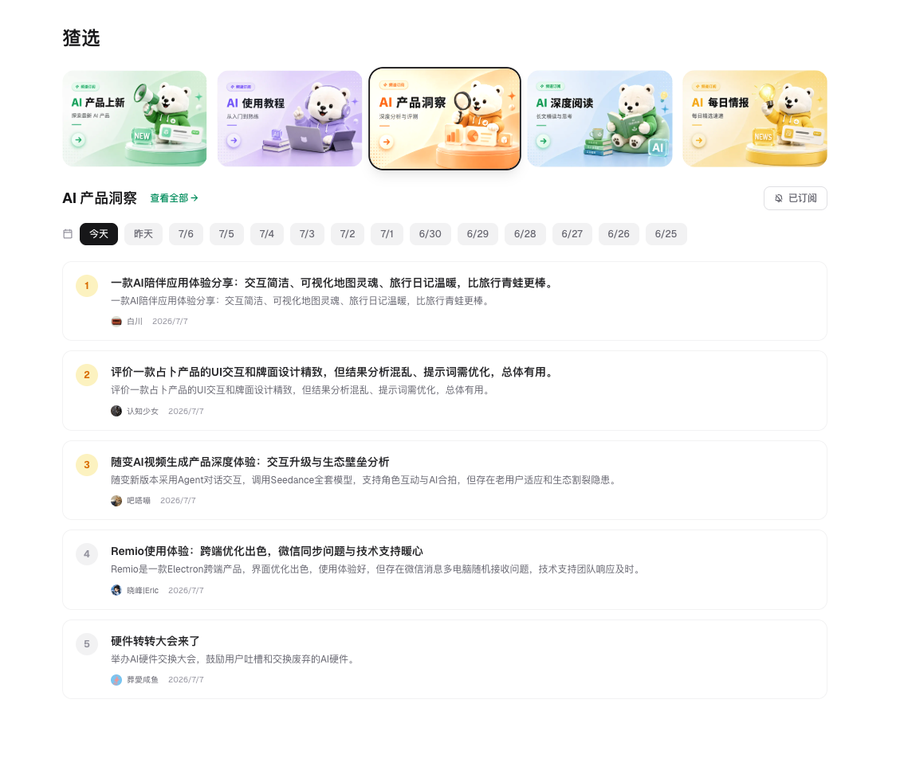
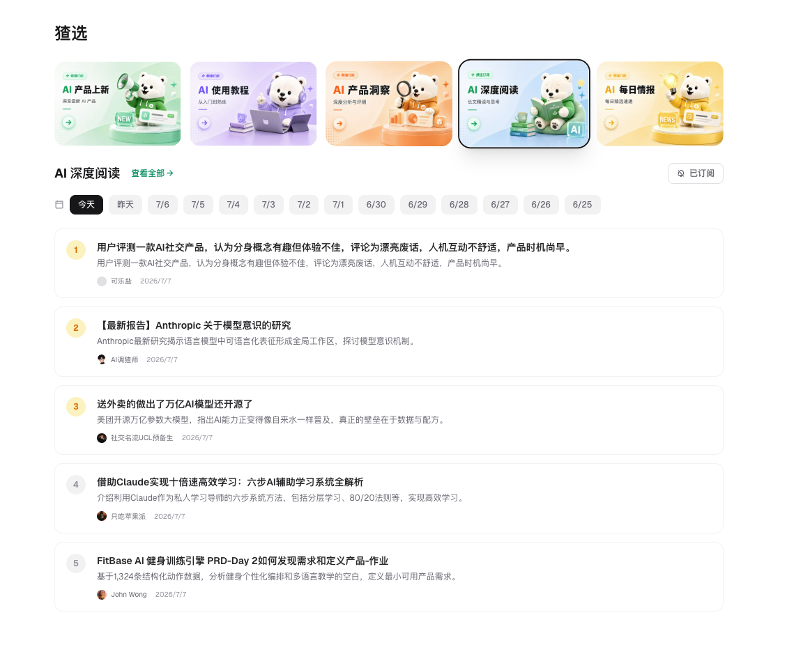
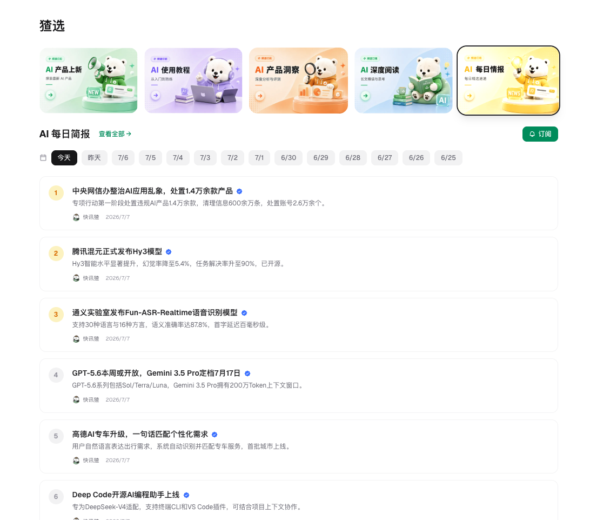
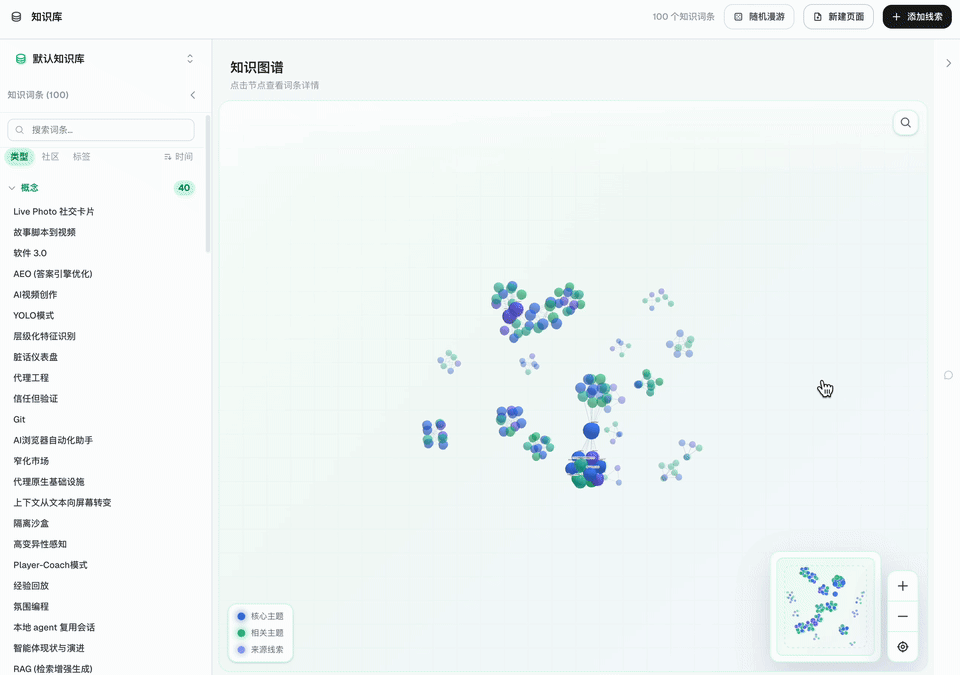

<p align="center">
  
</p>

<p align="center">
  
</p>

<h1 align="center">品猹 Pincha</h1>

<p align="center">
  让信息有归处。<br/>
  Where Content Becomes Knowledge.
</p>

<p align="center">
  面向学习者，把视频、播客、文章与每日线索转化为可理解、可沉淀、可追问的知识。
</p>

<p align="center">
  体验地址：<a href="https://pincha.watcha.cn/">pincha.watcha.cn</a>，目前免费开放，欢迎直接体验。
</p>

<p align="center">
  <a href="LICENSE"></a>
  <a href="docker-compose.yml"></a>
  
</p>

<hr/>

## ✨ 什么是品猹

**品猹**是观猹旗下的开源项目，面向学习者，解决两个核心问题：**更高效地理解内容**，**更系统地沉淀知识**。

它帮助你在观看视频、阅读内容时，更快抓住重点，用更少的时间理解更多实质内容；也帮助你把看过的内容沉淀成**知识词条**和**知识图谱**，并借助大模型随时提问、总结和提取，让这些内容持续变成你的**第二大脑**。

<hr/>

## 🤝 大力支持

<p align="center">
  
</p>

<p align="center">
  <strong>品猹的内容处理能力由 TokenDance 提供支持。</strong>
</p>

<hr/>

## 🧩 功能介绍

### 🎬 1. 视频解析

**视频解析**会把长视频拆成更容易消化的结构，帮你在更短的时间里抓住核心内容，而不是被完整时长拖住。

<p align="center">
  
</p>

你会得到：
- 字幕实时转换
- 四级摘要
- 可点击跳转的思维导图
- 基于视频内容的大模型问答

从字幕、摘要到**可点击跳转的思维导图**和问答，品猹把视频变成可以继续理解、继续追问的内容。

<hr/>

### 📰 2. 观猹内容推送

**你会得到观猹站内的每日精选推送。**  
我们会持续帮你筛出值得细读的内容，你可以把它们当作进入知识库的素材。

<table align="center">
  <tr>
    <td></td>
    <td></td>
    <td></td>
    <td></td>
    <td></td>
  </tr>
</table>

左右滑动查看这组每日推送截图。

我们不是简单把信息堆给你，而是先替你做一层筛选，再把每天真正有价值的内容整理出来，方便你继续阅读、继续沉淀。

<hr/>

### 🗂️ 3. 知识库

**知识库**会把视频解析和每日推送沉淀下来，再拆成知识词条，形成知识图谱。你可以点进图谱继续看词条，也可以直接让大模型随时回答问题。

<p align="center">
  
</p>

知识库的重点是把内容真正沉淀下来：
- 知识词条
- 知识图谱
- 大模型随时提问
- 搭建你的第二大脑

<hr/>

## 🏗️ 架构

```text
frontend/        Next.js App Router, React, Tailwind CSS
backend/         FastAPI API and processing services
workers          Celery workers for media, summaries, and indexing
postgres         relational data plus pgvector
redis            cache, queues, and realtime coordination
nginx            reverse proxy for local/container deployment
```

前端通过类型化 API 客户端和后端通信。长任务会通过轮询或 SSE 上报进度，完成后的结果会被缓存并建立索引，方便后续复用。

<hr/>

## 🚀 如何自己部署

**品猹支持两种使用方式：Docker 部署和本地开发部署。**

如果你只是想先体验，推荐优先使用 Docker；如果你要改代码或做二次开发，再走本地开发部署。

### 🐳 方式一：Docker 部署（推荐）

**最简单的部署方式，一行命令即可启动：**

```bash
docker compose up --build
```

访问 `http://localhost:3000`，在 Web 界面的设置页面配置你的 API Key 即可使用。

**Docker 部署说明：**
- 容器内不包含任何 API Key，需要在 Web 界面配置
- `history` 目录用于持久化历史记录
- `output` 目录用于持久化生成结果
- 如有需要，也可以挂载自定义配置文件

### 💻 方式二：本地开发部署

**前置要求：**
- Python 3.11+
- Node.js 18+
- pnpm
- uv

#### 1. 克隆项目

```bash
git clone <你的仓库地址>
cd pincha
```

#### 2. 配置基础环境

```bash
cp .env.example .env
```

然后在 Web 界面或 `.env` 中配置最基础的 API Key。

#### 3. 安装依赖

**后端：**

```bash
uv sync
```

**前端：**

```bash
cd frontend
pnpm install
```

#### 4. 启动服务

**一键启动（推荐）：**

- macOS：`start.sh` 或双击 `scripts/start-macos.command`
- Linux：`./start.sh`
- Windows：双击 `start.bat`

启动后会自动打开浏览器访问 `http://localhost:5173`

**手动启动：**

后端：

```bash
uv run python -m backend.app
```

前端：

```bash
cd frontend
pnpm dev
```

**访问：**
- 前端：`http://localhost:5173`
- 后端：`http://localhost:3000` 或你的实际配置地址

<hr/>

## ⚙️ 配置说明

### ✅ 推荐配置

#### 1. 大模型 API Key

**品猹的内容理解、摘要生成、知识抽取和问答能力，都依赖大模型 API。**

我们推荐使用 **TokenDance** 作为主要的大模型服务入口。

你只需要在 TokenDance 上获取 API Key，然后填入品猹即可开始使用解析、总结和知识沉淀功能。

#### 2. 字幕获取 API

**品猹的视频解析优先依赖字幕。**

如果视频本身已经带有可用字幕，品猹会直接使用字幕进行解析；如果没有字幕，当前不会走通用 ASR 兜底。

我们首要推荐的是免费的 **TranscriptAPI**。
你只需要去 TranscriptAPI 的官方地址获取 API Key，填入后就能直接使用字幕获取能力。

如果你愿意提升字幕命中率，或者增加更多回退来源，也可以继续配置其他字幕服务。

### 🧰 其他配置

**以下配置都属于可选项。** 如果你只想快速开始，通常只配置 `TokenDance` 和 `TranscriptAPI` 就够了。

```env
TIKHUB_API_KEY=your_tikhub_key
TRANSCRIPTAPI_API_KEY=your_transcriptapi_key
SUPADATA_API_KEY=
TRANSCRIPTHQ_API_KEY=
YOUTUBE_COOKIES_PATH=/app/cookies/cookies.txt
YOUTUBE_PROXY=
POT_PROVIDER_HTTP_BASE=
```

**这些配置的作用分别是：**
- `TIKHUB_API_KEY`：YouTube 字幕获取的优先回退来源
- `TRANSCRIPTAPI_API_KEY`：免费且推荐的字幕获取来源
- `SUPADATA_API_KEY`：字幕回退来源之一
- `TRANSCRIPTHQ_API_KEY`：多平台字幕回退来源之一
- `YOUTUBE_COOKIES_PATH`：可选的 YouTube cookies 文件路径
- `YOUTUBE_PROXY`：可选的 YouTube 代理
- `POT_PROVIDER_HTTP_BASE`：可选的 PO token provider

### 📌 推荐使用顺序

如果你只是想先跑起来，建议按这个顺序配置：

1. TokenDance 的大模型 API Key
2. TranscriptAPI 的字幕 API Key
3. 先不配其他回退项，确认主流程可用后再补充

### ⚠️ 注意事项

- 容器里不会内置任何 API Key，需要你自己在 Web 界面或环境变量里配置
- 品猹的视频解析依赖字幕，优先使用已有字幕
- 如果目标视频没有字幕，当前不会走通用 ASR 兜底
- `TranscriptAPI` 是我们最推荐的字幕入口，免费且足够直接
- 其他字幕配置主要用于补充回退，不是必需项

<hr/>

## 🛠️ 开发

只启动基础设施：

```bash
docker compose -f docker-compose.infra.yml up -d
```

后端：

```bash
cd backend
pip install -r requirements.txt
pip install -r requirements-test.txt
pytest
```

前端：

```bash
cd frontend
npm ci
npm run lint
npm run test
npm run build
```

端到端测试：

```bash
cd frontend
npm run test:e2e
```

`tests/infrastructure/` 下的基础设施测试是可选项，主要用于验证 Docker/nginx。会访问真实媒体链接的脚本属于人工检查，不是默认 CI 测试。

<hr/>

## 🔒 安全说明

品猹 Community Edition 是单用户本地部署版本，不建议直接暴露到公网。

不要提交 `.env`、token、cookie、私密日志、生产环境域名或凭证。若不小心提交了密钥，应立即轮换。后续再删除并不能从 Git 历史里抹掉它。

<hr/>

## 📚 文档

- [部署说明](docs/deployment.md)
- [环境示例](.env.example)
- [前端路由](docs/frontend-routes.md)
- [设计系统](docs/design-system.md)
- [贡献指南](CONTRIBUTING.md)

<hr/>

## 📄 许可证

Apache 2.0，见 [LICENSE](LICENSE)。
