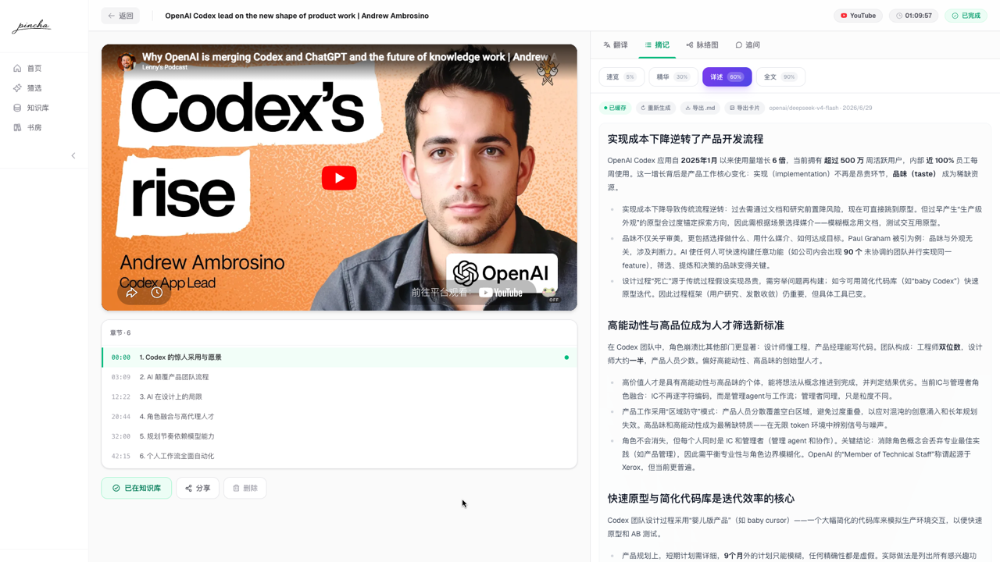
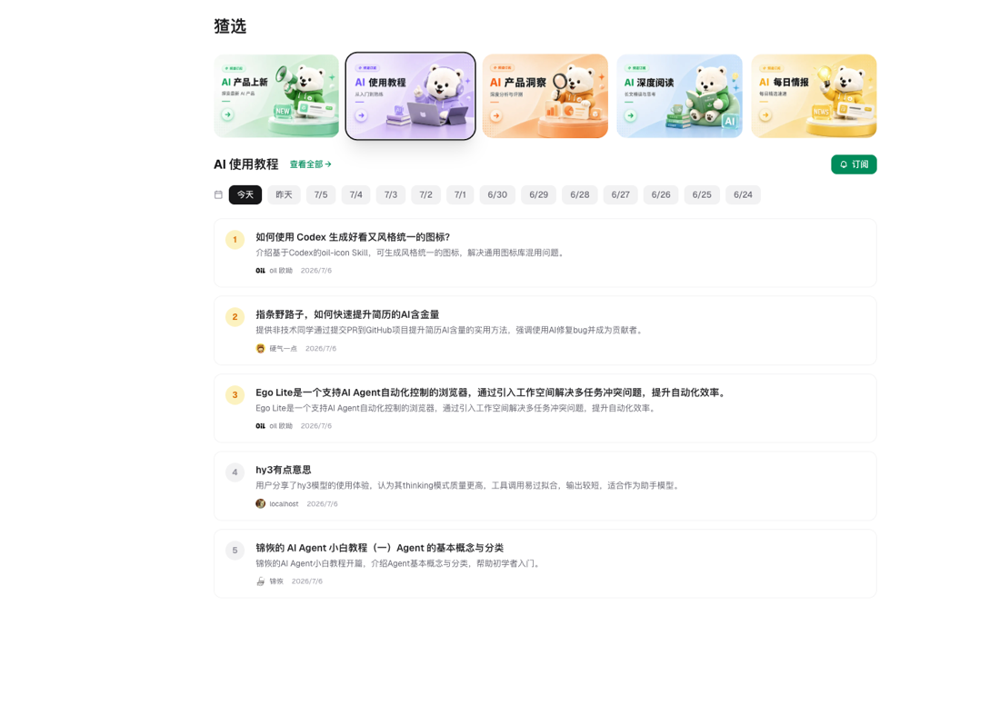
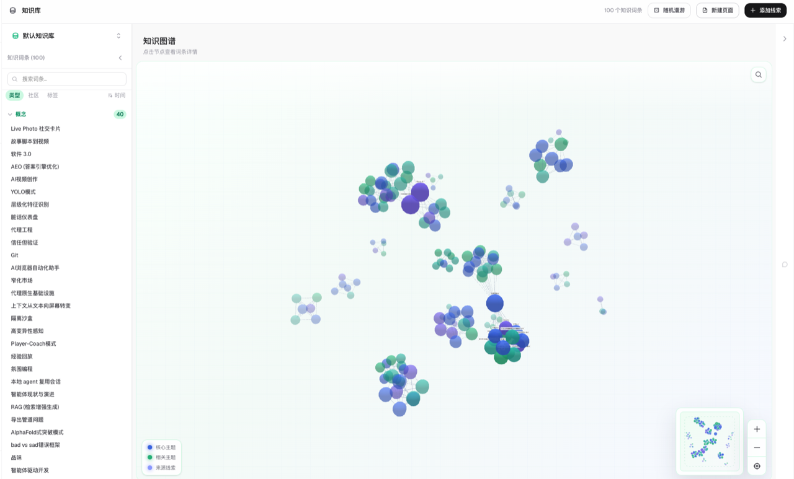

<p align="center">
  
</p>

<p align="center">
  
</p>

<h1 align="center">品猹 Pincha</h1>

<p align="center">
  让信息有归处。<br/>
  Where Content Becomes Knowledge.
</p>

<p align="center">
  把视频、播客、文章与每日线索整理成可检索、可追问、可复用的个人知识库。
</p>

<p align="center">
  <a href="LICENSE"></a>
  <a href="docker-compose.yml"></a>
  
</p>

## 什么是品猹

品猹是观猹旗下的开源项目，专注把长内容变成可阅读、可追问、可沉淀的知识。

它适合两类人：
- 想本地部署、自己掌控数据的开发者
- 想快速理解产品、用内容搭建个人知识体系的普通用户

## 大力支持

<p align="center">
  
</p>

<p align="center">
  本项目的 AI 能力额度由 TokenDance 支持。
</p>

## 功能介绍

### 1. 视频解析

视频解析会把长视频拆成更容易消化的结构：

<p align="center">
  
</p>

你会得到：
- 字幕实时转换
- 四级摘要
- 思维导图
- 基于视频内容的大模型问答

它的目标不是只给你一份摘要，而是把一条长内容变成可继续追问的知识。

### 2. 观猹内容推送

观猹内容推送会帮你持续筛选值得细读的内容：

<p align="center">
  
</p>

你会收到：
- 订阅频道
- 每日精选内容
- 每早八点推送
- 把最有价值的内容先筛出来

这些内容不只是看过就结束，也可以继续进入知识库。

### 3. 知识库

知识库会把视频解析和每日推送沉淀下来，再拆成知识词条，形成知识图谱。你可以点进图谱继续看词条，也可以直接让大模型随时回答问题。

<p align="center">
  
</p>

<p align="center">
  
</p>

知识库的重点是把内容真正沉淀下来：
- 知识词条
- 知识图谱
- 大模型随时提问
- 搭建你的第二大脑

## 架构

```text
frontend/        Next.js App Router, React, Tailwind CSS
backend/         FastAPI API and processing services
workers          Celery workers for media, summaries, and indexing
postgres         relational data plus pgvector
redis            cache, queues, and realtime coordination
nginx            reverse proxy for local/container deployment
```

前端通过类型化 API 客户端和后端通信。长任务会通过轮询或 SSE 上报进度，完成后的结果会被缓存并建立索引，方便后续复用。

## 快速开始

### 要求

- Docker 和 Docker Compose
- 一个兼容 OpenAI 的大模型 API Key
- 可选：一个兼容的语音转写服务

### 配置

```bash
cp .env.example .env
```

至少配置这些值：

```env
POSTGRES_PASSWORD=change_me_to_a_real_password
OPENAI_API_KEY=replace_with_your_llm_api_key
```

可选的语音转写配置：

```env
WHISPER_API_BASE=https://api.example.com/v1
WHISPER_API_KEY=replace_with_your_asr_api_key
WHISPER_MODEL=whisper-1
```

如果视频本身已经带有可用字幕，品猹可以直接处理，不必额外走 ASR。

### 启动

```bash
docker compose up --build
```

打开：

- App: http://localhost:3000
- API health: http://localhost:8000/health

## 开发

只启动基础设施：

```bash
docker compose -f docker-compose.infra.yml up -d
```

后端：

```bash
cd backend
pip install -r requirements.txt
pip install -r requirements-test.txt
pytest
```

前端：

```bash
cd frontend
npm ci
npm run lint
npm run test
npm run build
```

端到端测试：

```bash
cd frontend
npm run test:e2e
```

`tests/infrastructure/` 下的基础设施测试是可选项，主要用于验证 Docker/nginx。会访问真实媒体链接的脚本属于人工检查，不是默认 CI 测试。

## 安全说明

品猹 Community Edition 是单用户本地部署版本，不建议直接暴露到公网。

不要提交 `.env`、token、cookie、私密日志、生产环境域名或凭证。若不小心提交了密钥，应立即轮换。后续再删除并不能从 Git 历史里抹掉它。

## 文档

- [部署说明](docs/deployment.md)
- [环境示例](.env.example)
- [前端路由](docs/frontend-routes.md)
- [设计系统](docs/design-system.md)
- [贡献指南](CONTRIBUTING.md)

## 许可证

Apache 2.0，见 [LICENSE](LICENSE)。
